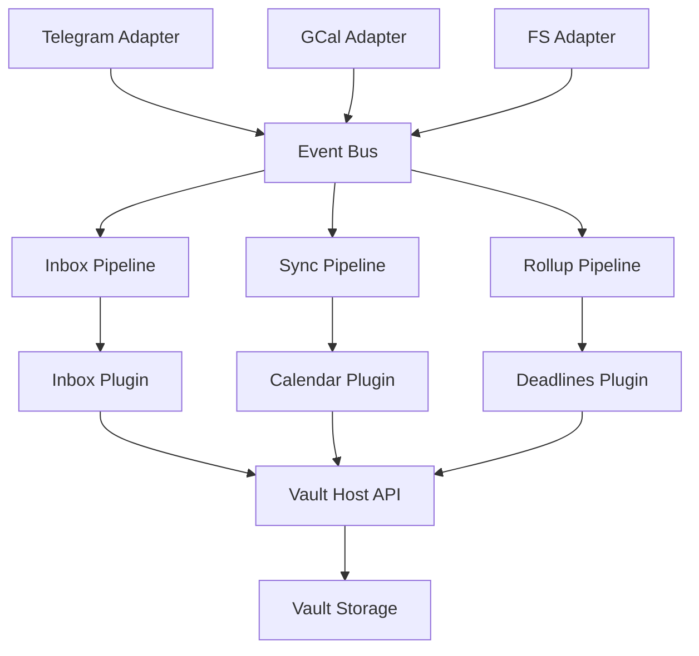

# Архитектура Kira

## Обзор

Kira — это плагинная платформа для управления знаниями и задачами, построенная на принципах реактивной архитектуры и строгой типизации.

## Ключевые принципы

- **Плагинная архитектура**: Расширяемость через плагины и адаптеры
- **Реактивность**: Event-driven архитектура с шиной событий
- **Типизация**: Строгая типизация Python с валидацией
- **Изоляция**: Безопасное выполнение плагинов в sandbox
- **Консистентность**: Единые схемы данных и контракты

## Компоненты системы

### Ядро (Core)
- **Host API**: Единая точка доступа к Vault
- **Event Bus**: Шина событий для реактивности
- **Scheduler**: Планировщик задач и cron
- **Sandbox**: Изоляция выполнения плагинов
- **Schemas**: Валидация данных и контракты

### SDK для плагинов
- **Context**: Контекст выполнения плагина
- **Decorators**: Декораторы для событий и команд
- **Types**: Типизированные сущности Vault
- **Permissions**: Система разрешений
- **RPC**: Межпроцессное взаимодействие

### Адаптеры
- **Telegram**: Основной UX через Telegram
- **Google Calendar**: Синхронизация календаря
- **Filesystem**: Мониторинг файловой системы

### Плагины
- **Inbox**: Нормализация входящих сообщений
- **Calendar**: Управление событиями и таймбоксинг
- **Deadlines**: Управление задачами и дедлайнами
- **Mailer**: Отправка писем и уведомлений

### Конвейеры (Pipelines)
- **Inbox Pipeline**: Обработка входящих элементов
- **Sync Pipeline**: Синхронизация с внешними системами
- **Rollup Pipeline**: Создание отчетов и сводок

## Архитектурные решения

Все важные архитектурные решения документированы в [Architecture Decision Records (ADR)](adr/README.md):

- [ADR-001](adr/ADR-001-monorepo-src-layout.md): Monorepo структура
- [ADR-002](adr/ADR-002-stable-plugin-sdk.md): Стабильный Plugin SDK
- [ADR-003](adr/ADR-003-plugin-manifest-json-schema.md): Манифест плагинов
- [ADR-004](adr/ADR-004-sandbox-permissions-subprocess.md): Sandbox и разрешения
- [ADR-005](adr/ADR-005-event-bus-scheduler-thalamus.md): Event Bus и планировщик
- [ADR-006](adr/ADR-006-vault-host-api-no-direct-fs.md): Host API для Vault
- [ADR-007](adr/ADR-007-schemas-folder-contracts-single-source.md): Схемы как источник истины
- [ADR-008](adr/ADR-008-ids-naming-conventions.md): Идентификаторы и именование
- [ADR-009](adr/ADR-009-pipelines-thin-orchestration.md): Тонкие конвейеры
- [ADR-010](adr/ADR-010-cli-make-canonical-interface.md): CLI как канонический интерфейс

## Поток данных

## Безопасность

- **Sandbox**: Плагины выполняются в изолированных процессах
- **Permissions**: Явная система разрешений для каждого действия
- **Validation**: Валидация всех данных по схемам
- **Audit**: Логирование всех операций с trace_id

## Производительность

- **Async**: Асинхронная обработка событий
- **Caching**: Кэширование схем и метаданных
- **Batching**: Группировка операций для эффективности
- **Monitoring**: Структурированные логи и метрики

## Расширяемость

- **Plugin SDK**: Стабильный API для разработки плагинов
- **Event System**: Легкое добавление новых обработчиков
- **Schema Evolution**: Версионирование схем данных
- **Migration Tools**: Инструменты для миграции данных

## Связанные документы

- [Документация плагинов](plugins.md)
- [Конфигурация системы](configuration.md)
- [CLI команды](cli.md)
- [Реестр плагинов](registry.md)
- [Права доступа](permissions.md)
- [Sandbox](sandbox.md)
