# Architecture Issues - Visual Diagrams

This document provides visual representations of the identified issues and their solutions.

---

## Issue #1 & #2: Executor & Session ID Confusion

### Current State (Problematic)

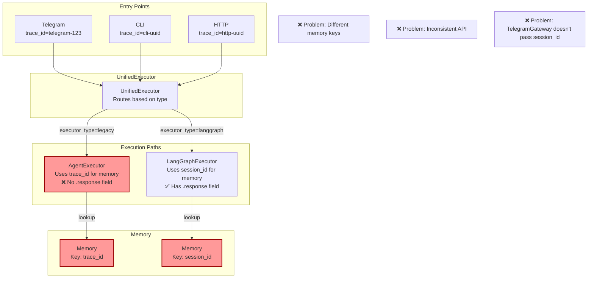

### Proposed Solution

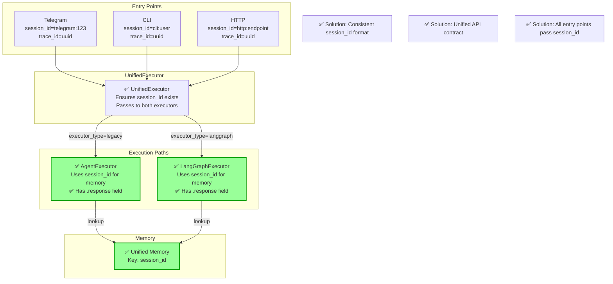

---

## Issue #7 & #8: Tool Validation & FSM Guards

### Current Flow (Problematic)

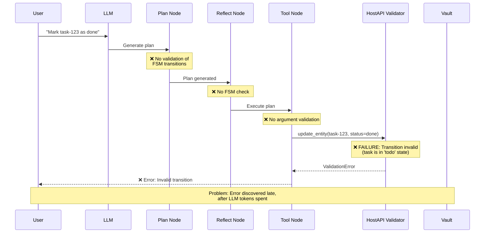

### Proposed Flow (Fixed)

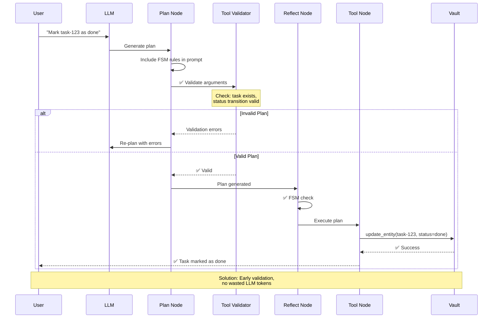

---

## Issue #9: Link Graph Race Condition

### Current Flow (Race Condition)

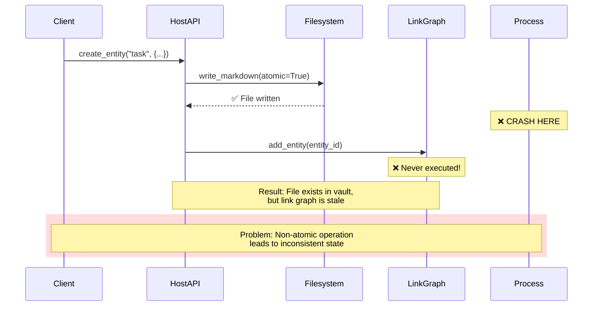

### Proposed Flow (Journal-Based Recovery)

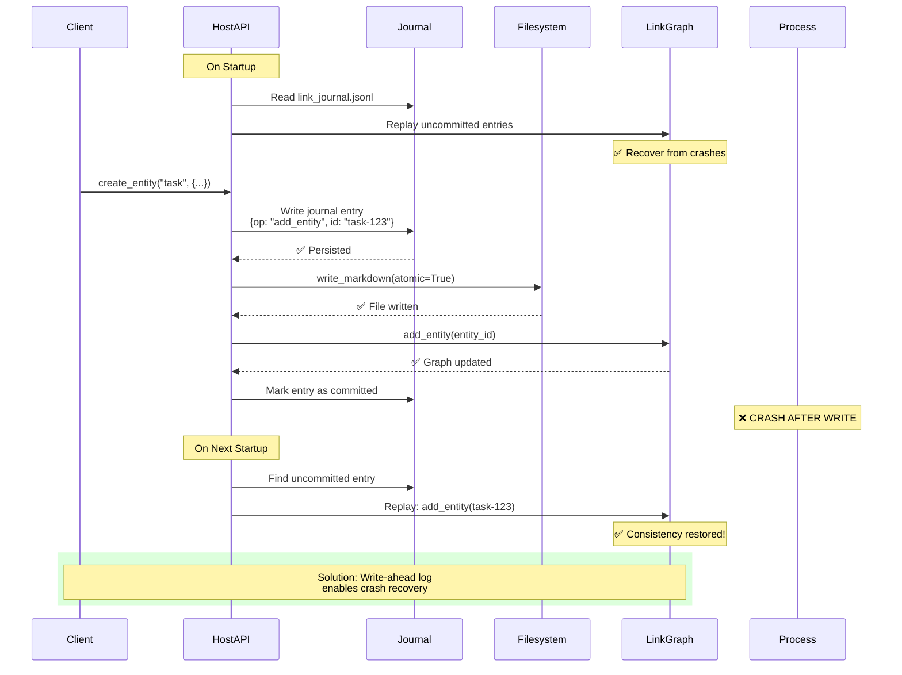

---

## Issue #12: Memory Leak

### Current Memory Growth

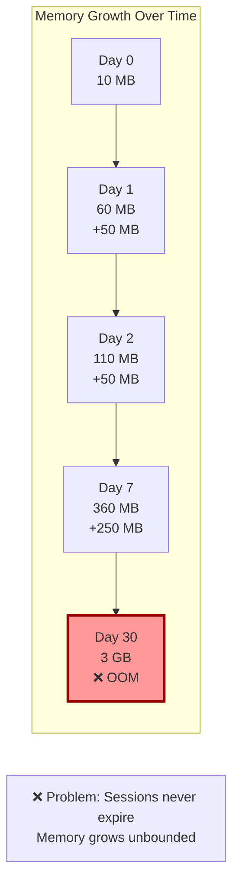

### Proposed Memory Management

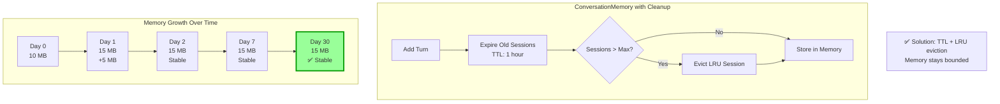

---

## Data Flow Comparison

### Before Fixes (Inconsistent Paths)

```mermaid
flowchart TB
    subgraph Telegram Path
        TG1[Telegram Message] --> TG2[EventBus]
        TG2 --> TG3[MessageHandler]
        TG3 --> TG4[UnifiedExecutor]
        TG4 --> TG5[LangGraph]
        TG5 --> TG6[NL Response ✅]
    end

    subgraph CLI Path
        CLI1[CLI Command] --> CLI2[UnifiedExecutor]
        CLI2 --> CLI3[AgentExecutor]
        CLI3 --> CLI4[Tool Results]
        CLI4 --> CLI5[Manual Format ❌]
    end

    subgraph HTTP Webhook Path
        HTTP1[HTTP Request] --> HTTP2[TelegramGateway]
        HTTP2 --> HTTP3[AgentExecutor]
        HTTP3 --> HTTP4[Tool Results]
        HTTP4 --> HTTP5[Manual Format ❌]
    end

    style TG6 fill:#9f9,stroke:#090
    style CLI5 fill:#f99,stroke:#900
    style HTTP5 fill:#f99,stroke:#900

    note[❌ Problem: Different response formats<br/>by entry point]
```

### After Fixes (Unified Paths)

```mermaid
flowchart TB
    subgraph Telegram Path
        TG1[Telegram Message] --> TG2[EventBus]
        TG2 --> TG3[MessageHandler]
        TG3 --> TG4[UnifiedExecutor]
        TG4 --> TG5[LangGraph]
        TG5 --> TG6[NL Response ✅]
    end

    subgraph CLI Path
        CLI1[CLI Command] --> CLI2[UnifiedExecutor]
        CLI2 --> CLI3[AgentExecutor with NL]
        CLI3 --> CLI4[Tool Results + NL]
        CLI4 --> CLI5[NL Response ✅]
    end

    subgraph HTTP Webhook Path
        HTTP1[HTTP Request] --> HTTP2[TelegramGateway]
        HTTP2 --> HTTP3[UnifiedExecutor]
        HTTP3 --> HTTP4[AgentExecutor with NL]
        HTTP4 --> HTTP5[NL Response ✅]
    end

    style TG6 fill:#9f9,stroke:#090
    style CLI5 fill:#9f9,stroke:#090
    style HTTP5 fill:#9f9,stroke:#090

    note[✅ Solution: All paths generate NL responses<br/>Consistent user experience]
```

---

## Component Dependency Graph

### Current State (Circular Dependencies Risk)

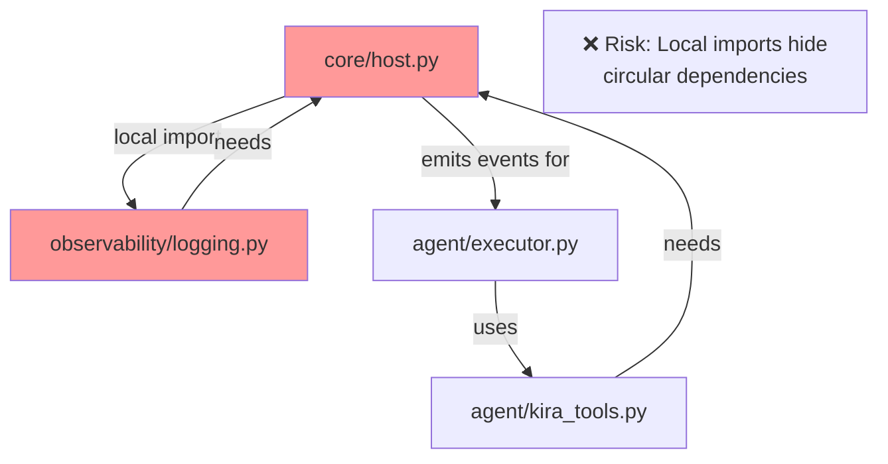

### Proposed State (Clean Dependencies)

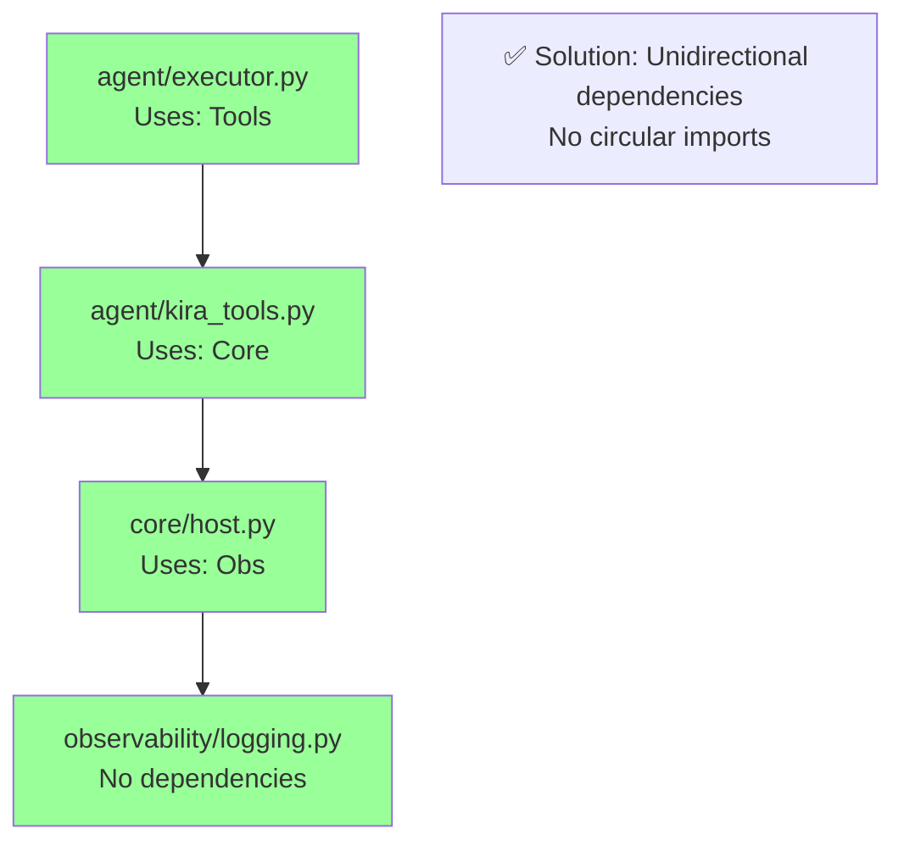

---

## Execution State Flow

### Current: Lost Context

```mermaid
stateDiagram-v2
    [*] --> AgentState: User request

    state AgentState {
        [*] --> Planning
        Planning --> Reflecting
        Reflecting --> Executing
        Executing --> Verifying
        Verifying --> Responding
        Responding --> [*]

        note right of AgentState
            Rich state:
            - trace_id
            - messages
            - plan
            - current_step
            - tool_results
            - memory
            - budget
            - flags
            - retry_count
        end note
    }

    AgentState --> ExecutionResult: Conversion

    state ExecutionResult {
        note left of ExecutionResult
            ❌ Simplified state:
            - trace_id
            - status
            - error
            - tool_results
            - response

            LOST:
            - plan
            - memory
            - budget
            - retry_count
        end note
    }

    ExecutionResult --> [*]: Return to caller
```

### Proposed: Preserved Context

```mermaid
stateDiagram-v2
    [*] --> AgentState: User request

    state AgentState {
        [*] --> Planning
        Planning --> Reflecting
        Reflecting --> Executing
        Executing --> Verifying
        Verifying --> Responding
        Responding --> [*]
    }

    AgentState --> ExecutionResult: Conversion

    state ExecutionResult {
        note right of ExecutionResult
            ✅ Rich result:
            - trace_id
            - status
            - error
            - tool_results
            - response

            + ExecutionContext:
              - plan
              - memory
              - budget
              - retry_count
              - flags
        end note
    }

    ExecutionResult --> [*]: Return to caller
```

---

## Summary Metrics Dashboard

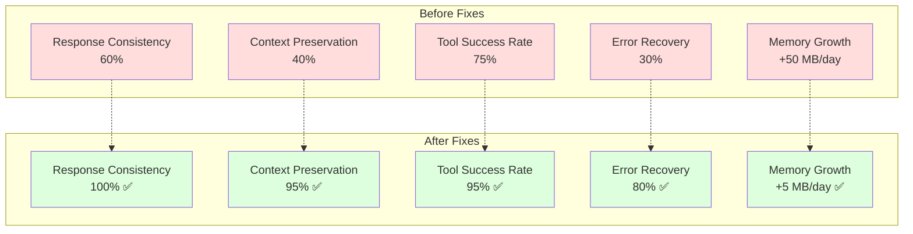

---

**Note**: These diagrams illustrate the key architectural issues and proposed solutions. For detailed implementation code, see the [full error analysis report](../reports/006-comprehensive-error-analysis.md).

