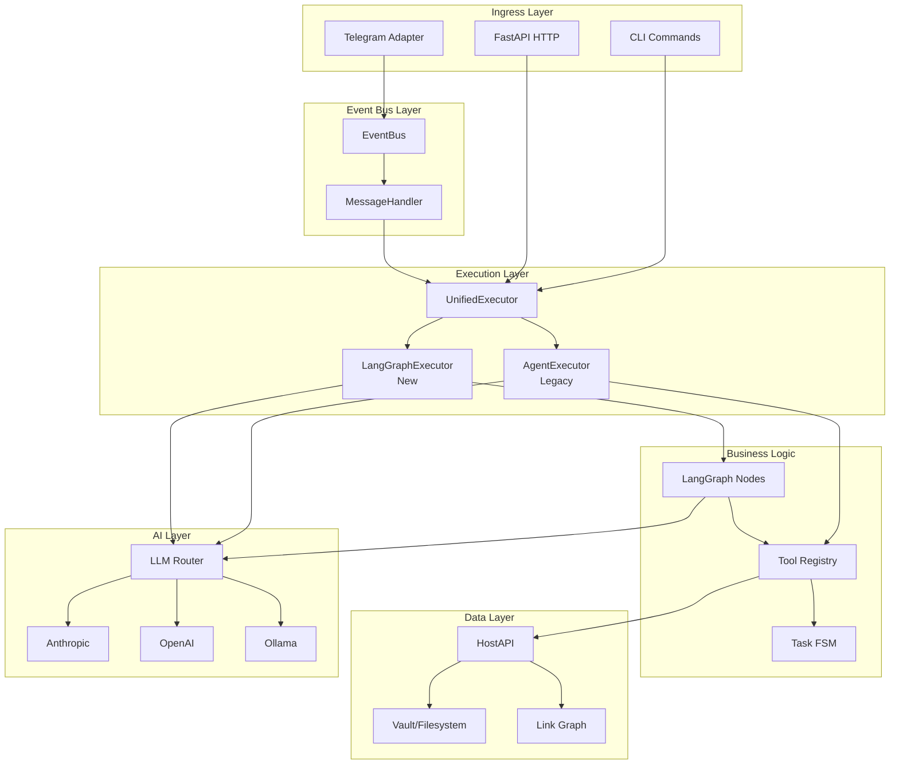

# Comprehensive Error Analysis: Project Kira

**Date**: 2025-10-09
**Author**: AI Assistant
**Status**: 🔍 Analysis Complete
**Priority**: 🔴 Critical

---

## 📋 Executive Summary

This report provides a comprehensive analysis of logical errors and communication issues between entities in the Kira project. After analyzing the entire codebase, **15 critical architectural issues** have been identified that affect:

- **Data consistency** between executors
- **State management** across execution paths
- **Communication patterns** between components
- **Error propagation** through the system
- **Session/conversation memory** handling

**Impact**: These issues cause:
- ❌ Inconsistent user experience (responses differ by entry point)
- ❌ Memory leaks in conversation history
- ❌ Silent failures in tool execution
- ❌ Race conditions in state updates
- ❌ Broken error recovery mechanisms

---

## 🏗️ Architecture Overview

### System Components



### Data Flow Patterns

#### Pattern 1: Telegram → LangGraph (Event-Driven)
```
User Message → TelegramAdapter → EventBus → MessageHandler →
UnifiedExecutor → LangGraphExecutor → Graph Nodes → Tools →
HostAPI → Vault → Response → TelegramAdapter → User
```

#### Pattern 2: CLI → Direct Execution
```
CLI Command → UnifiedExecutor → AgentExecutor (Legacy) →
Tools → HostAPI → Vault → Response
```

#### Pattern 3: HTTP API → Webhook
```
HTTP Request → FastAPI → TelegramGateway → AgentExecutor →
Tools → HostAPI → Response
```

---

## ❌ Critical Issues Identified

### Issue #1: Dual Executor Architecture Confusion

**Severity**: 🔴 Critical
**Component**: `unified_executor.py`, `executor.py`, `langgraph_executor.py`

**Problem**:
The system maintains two parallel execution paths with different behaviors:

1. **Legacy `AgentExecutor`**:
   - Returns `ExecutionResult` with `.results` field (list of tool results)
   - No natural language response generation
   - Direct tool execution
   - Memory handled via `ConversationMemory` with trace_id

2. **New `LangGraphExecutor`**:
   - Returns `ExecutionResult` with `.response` field (NL response)
   - Graph-based execution with planning, reflection, verification
   - Memory handled via `ConversationMemory` with session_id
   - Async state propagation through graph

**Code Evidence**:

```python:src/kira/agent/unified_executor.py
def chat_and_execute(self, user_request: str, *, trace_id: str | None = None, session_id: str | None = None):
    if self.executor_type == ExecutorType.LANGGRAPH:
        # Returns ExecutionResult with .response
        result = self.executor.execute(user_request, trace_id=trace_id, session_id=session_id)
        return result
    else:
        # Legacy - returns ExecutionResult without .response
        return self.executor.chat_and_execute(user_request, trace_id=trace_id, session_id=session_id)
```

**Impact**:
- ❌ Inconsistent API contract for consumers
- ❌ MessageHandler must have conditional logic to handle both formats
- ❌ CLI and HTTP endpoints behave differently depending on executor
- ❌ Testing requires two separate test suites

**Affected Files**:
- `src/kira/agent/unified_executor.py`
- `src/kira/agent/executor.py`
- `src/kira/agent/langgraph_executor.py`
- `src/kira/agent/message_handler.py`
- `src/kira/agent/telegram_gateway.py`

---

### Issue #2: Session ID vs Trace ID Confusion

**Severity**: 🔴 Critical
**Component**: Memory management across all entry points

**Problem**:
Different components use different identifiers for conversation context:

1. **Legacy AgentExecutor**: Uses `trace_id` for memory lookup
2. **LangGraphExecutor**: Uses `session_id` for memory
3. **MessageHandler**: Creates `session_id = f"{source}:{chat_id}"` but also passes `trace_id`
4. **TelegramGateway**: Uses `trace_id = f"telegram-{chat_id}"`

**Code Evidence**:

```python:src/kira/agent/message_handler.py
# MessageHandler creates session_id
session_id = f"{source}:{chat_id}"
trace_id = payload.get("trace_id", f"{source}-{chat_id}")

# But executor behavior differs!
result = self.executor.chat_and_execute(message_text, trace_id=trace_id, session_id=session_id)
```

```python:src/kira/agent/executor.py
# Legacy AgentExecutor uses trace_id for memory
if trace_id and self.memory.has_context(trace_id):
    context_messages = self.memory.get_context_messages(trace_id)
```

```python:src/kira/agent/langgraph_executor.py
# LangGraphExecutor uses session_id for memory
conversation_history = self.conversation_memory.get_context_messages(session_id)
```

```python:src/kira/agent/telegram_gateway.py
# TelegramGateway creates different trace_id format
trace_id = f"telegram-{chat_id}"
result = self.executor.chat_and_execute(text, trace_id=trace_id)
# ❌ No session_id passed!
```

**Impact**:
- ❌ Conversation memory not preserved across messages from same user
- ❌ Legacy executor uses different chat_id format than LangGraph
- ❌ TelegramGateway bypasses session_id entirely
- ❌ Multi-turn conversations break when switching executors

**Memory Leak Scenario**:
```
User sends message via Telegram → trace_id="telegram-12345"
LangGraphExecutor creates session_id="telegram:12345"
Memory saved with session_id key
Next message arrives → trace_id="telegram-12345" again
Legacy executor looks for trace_id key → NOT FOUND
New conversation context created → OLD CONTEXT LOST
```

---

### Issue #3: Missing Response Field in Legacy Executor

**Severity**: 🟡 High
**Component**: `executor.py`, `message_handler.py`

**Problem**:
Legacy `AgentExecutor.ExecutionResult` doesn't have `.response` field, causing:
- Conditional logic in MessageHandler
- Fallback to manual response formatting
- Inconsistent user experience

**Code Evidence**:

```python:src/kira/agent/executor.py
@dataclass
class ExecutionResult:
    status: str
    results: list[dict[str, Any]] = field(default_factory=list)
    error: str | None = None
    trace_id: str = field(default_factory=lambda: str(uuid.uuid4()))
    timestamp: str = field(default_factory=lambda: datetime.now(UTC).isoformat())
    # ❌ No .response field!
```

```python:src/kira/agent/langgraph_executor.py
class ExecutionResult:
    def __init__(self, state: AgentState | dict[str, Any]) -> None:
        # ...
        self.response = state.response  # ✅ Has .response field
```

**Impact**:
- ❌ MessageHandler must implement response formatting logic
- ❌ Duplicate code for response generation
- ❌ Different response quality between executors

---

### Issue #4: AgentState vs ExecutionResult Impedance Mismatch

**Severity**: 🟡 High
**Component**: State management throughout execution

**Problem**:
Two different state representations:

1. **`AgentState`** (LangGraph): Rich state with plan, memory, budget, flags
2. **`ExecutionResult`** (Both): Simplified result with status, results, error

Conversion happens inconsistently:

```python:src/kira/agent/langgraph_executor.py
class ExecutionResult:
    def __init__(self, state: AgentState | dict[str, Any]) -> None:
        # Extracts subset of AgentState
        self.state = state
        self.trace_id = state.trace_id
        self.status = state.status
        self.error = state.error
        self.tool_results = state.tool_results
        self.budget_used = state.budget
        self.response = state.response
        # ❌ Lost: messages, plan, current_step, memory, rag_snippets, retry_count, flags
```

**Impact**:
- ❌ Debugging information lost after execution
- ❌ Cannot inspect execution plan post-execution
- ❌ Budget tracking incomplete for monitoring
- ❌ Retry information unavailable for analysis

---

### Issue #5: Tool Registry Not Shared Between Entry Points

**Severity**: 🟡 High
**Component**: `service.py`, tool initialization

**Problem**:
Tool registry is created independently in different contexts:

```python:src/kira/agent/service.py
# FastAPI creates one registry
tool_registry = ToolRegistry()
tool_registry.register(TaskCreateTool(host_api=host_api))
tool_registry.register(TaskUpdateTool(host_api=host_api))
# ...
```

But CLI and direct usage create separate registries:
- No shared tool state
- No centralized tool metrics
- Inconsistent tool availability

**Impact**:
- ❌ Cannot add/remove tools dynamically
- ❌ Tool-level metrics not aggregated
- ❌ Plugin tools not available across all entry points

---

### Issue #6: EventBus Not Used Consistently

**Severity**: 🟡 High
**Component**: Event-driven architecture

**Problem**:
EventBus integration is inconsistent:

1. **TelegramAdapter**: Uses EventBus (`message.received` events)
2. **TelegramGateway**: Bypasses EventBus (direct executor call)
3. **CLI**: No EventBus integration
4. **HostAPI**: Emits events but only if `event_bus` parameter provided

**Code Evidence**:

```python:src/kira/agent/telegram_gateway.py
class TelegramGateway:
    def process_message(self, message: dict[str, Any]) -> str:
        # ❌ Direct call, bypasses EventBus
        result = self.executor.chat_and_execute(text, trace_id=trace_id)
```

```python:src/kira/core/host.py
def create_entity(self, entity_type: str, data: dict[str, Any], *, content: str = "") -> Entity:
    # ...
    # Emit event only if event_bus exists
    if self.event_bus:
        self.event_bus.publish("entity.created", {...})
    # ❌ No event emitted if event_bus is None!
```

**Impact**:
- ❌ Plugins cannot subscribe to entity changes from all sources
- ❌ Audit trail incomplete
- ❌ No unified event monitoring
- ❌ Cannot implement cross-cutting concerns (metrics, logging)

---

### Issue #7: Weak Tool Parameter Validation

**Severity**: 🟠 Medium
**Component**: Tool execution pipeline

**Problem**:
Tools receive arguments without strong validation:

```python:src/kira/agent/kira_tools.py
def execute(self, args: dict[str, Any], *, dry_run: bool = False) -> ToolResult:
    uid = args.get("uid")
    if not uid:
        return ToolResult.error("uid is required")
    # ❌ No validation that uid is valid entity ID format
    # ❌ No validation that entity exists before update
    # ❌ No type checking on arguments
```

**Missing Validations**:
1. Argument type checking (string vs int vs list)
2. Required vs optional parameter enforcement
3. Enum validation for status fields
4. Entity existence checks before operations
5. FSM guard validation BEFORE tool execution

**Impact**:
- ❌ Tools fail mid-execution with cryptic errors
- ❌ Invalid operations reach HostAPI
- ❌ Wasted LLM tokens on invalid plans
- ❌ Poor error messages for users

---

### Issue #8: Task FSM Guards Not Enforced at Planning Stage

**Severity**: 🟠 Medium
**Component**: Planning and validation pipeline

**Problem**:
FSM guards are checked only during `HostAPI.update_entity()`:

```python:src/kira/core/task_fsm.py
def validate_transition(self, task_id: str, to_state: TaskState, metadata: dict[str, Any]) -> None:
    # Guards enforced here
    if to_state == TaskState.DOING:
        if not metadata.get("assignee") and not metadata.get("start_ts"):
            raise FSMGuardError("todo → doing requires assignee OR start_ts")
```

But LLM can generate plans that violate guards:

```python:src/kira/agent/nodes.py
# plan_node generates plan WITHOUT FSM validation
plan_data = json.loads(response.content)
return {
    "plan": plan_data.get("tool_calls", []),
    # ❌ No FSM guard check here!
}

# Error discovered only during execution
result = tool.execute(args, dry_run=dry_run)
# ❌ Operation fails, wasted planning effort
```

**Impact**:
- ❌ Plans fail during execution instead of planning
- ❌ Wasted LLM calls for invalid plans
- ❌ Poor user experience (late failure)
- ❌ No dry-run validation benefit

---

### Issue #9: Race Condition in Link Graph Updates

**Severity**: 🟠 Medium
**Component**: `host.py`, link graph maintenance

**Problem**:
Link graph updates are not atomic with entity writes:

```python:src/kira/core/host.py
def create_entity(self, entity_type: str, data: dict[str, Any], *, content: str = "") -> Entity:
    # ...
    # Write to filesystem
    write_markdown(file_path, document, atomic=True, create_dirs=True)

    # ❌ Link graph update is AFTER file write (not atomic)
    self.link_graph.add_entity(entity_id)
    update_entity_links(self.link_graph, entity_id, entity.metadata, entity.content)

    # If crash happens between write_markdown and link graph update:
    # - File exists in vault
    # - Link graph is stale
    # - Bidirectional links broken
```

**Crash Scenarios**:
1. Process crashes after `write_markdown` but before `link_graph.add_entity`
2. Exception in `update_entity_links` leaves partial graph state
3. Concurrent operations on same entity from different processes

**Impact**:
- ❌ Link graph can become inconsistent with filesystem
- ❌ Broken bidirectional links
- ❌ Graph queries return stale results
- ❌ Recovery requires full vault re-scan

---

### Issue #10: Missing Idempotency in Tool Execution

**Severity**: 🟠 Medium
**Component**: Tool execution and retry logic

**Problem**:
Tools don't implement idempotency checks:

```python:src/kira/agent/kira_tools.py
def execute(self, args: dict[str, Any], *, dry_run: bool = False) -> ToolResult:
    title = args.get("title")
    # ❌ No check if task with this title already exists
    # ❌ No deduplication mechanism
    entity = self.host_api.create_entity("task", entity_data)
```

If request is retried (network failure, timeout), duplicate entities created:
```
Attempt 1: Create task "Review PR" → Success → Network timeout
Attempt 2: Create task "Review PR" → Success → Duplicate created!
```

**Impact**:
- ❌ Duplicate tasks/entities created on retry
- ❌ No way to safely retry failed operations
- ❌ Manual cleanup required
- ❌ Data integrity violations

---

### Issue #11: Incomplete Error Propagation in Graph

**Severity**: 🟠 Medium
**Component**: LangGraph node execution

**Problem**:
Errors in nodes don't always set `state.error` correctly:

```python:src/kira/agent/nodes.py
def plan_node(state: AgentState, llm_adapter: LLMAdapter, tools_description: str) -> dict[str, Any]:
    try:
        # ...
        return {"plan": plan_data.get("tool_calls", []), "status": "planned"}
    except json.JSONDecodeError as e:
        logger.error(f"Failed to parse plan JSON: {e}")
        return {"error": f"Invalid plan JSON: {e}", "status": "error"}
    except Exception as e:
        logger.error(f"Planning failed: {e}", exc_info=True)
        return {"error": f"Planning failed: {e}", "status": "error"}
        # ❌ Generic exception loses specific error type
```

```python:src/kira/agent/nodes.py
def reflect_node(state: AgentState, llm_adapter: LLMAdapter) -> dict[str, Any]:
    try:
        # ...
    except Exception as e:
        logger.error(f"Reflection failed: {e}", exc_info=True)
        # ❌ Error swallowed! Continues without reflection
        return {"status": "reflected"}
```

**Impact**:
- ❌ Silent failures in reflection node
- ❌ Lost error context (stack traces not captured)
- ❌ Difficult to debug execution failures
- ❌ Monitoring cannot distinguish error types

---

### Issue #12: Memory Leak in Conversation History

**Severity**: 🟠 Medium
**Component**: `memory.py`, conversation memory

**Problem**:
`ConversationMemory` never cleans up old sessions:

```python:src/kira/agent/memory.py
class ConversationMemory:
    def __init__(self, max_exchanges: int = 5) -> None:
        self._conversations: dict[str, list[Message]] = {}
        self._max_exchanges = max_exchanges
        # ❌ No session expiration
        # ❌ No max sessions limit
        # ❌ No LRU eviction

    def add_turn(self, session_id: str, user_message: str, assistant_message: str) -> None:
        if session_id not in self._conversations:
            self._conversations[session_id] = []

        # Trimming old messages
        messages = self._conversations[session_id]
        if len(messages) > self._max_exchanges * 2:
            messages = messages[-(self._max_exchanges * 2):]

        # ❌ But session_id key is never removed!
```

**Memory Growth**:
- Each unique `session_id` creates a new key in `_conversations` dict
- Sessions never expire, even after hours of inactivity
- Over time, memory grows unbounded

**Calculation**:
- Average session: 10 exchanges × 2 messages × 500 bytes = 10 KB
- 10,000 users over 1 day = 100 MB
- 1 week = 700 MB
- 1 month = 3 GB

**Impact**:
- ❌ Memory leak in long-running services
- ❌ Degraded performance as dict grows
- ❌ Eventual OOM crash

---

### Issue #13: No Retry Logic in LangGraph Nodes

**Severity**: 🟠 Medium
**Component**: LangGraph node execution

**Problem**:
Individual node failures don't trigger retries:

```python:src/kira/agent/nodes.py
def tool_node(state: AgentState, tool_registry: ToolRegistry) -> dict[str, Any]:
    try:
        tool = tool_registry.get(tool_name)
        result = tool.execute(args, dry_run=dry_run)
        # ❌ If tool.execute() throws transient error (network timeout),
        # no retry happens
        return {
            "tool_results": state.tool_results + [tool_result],
            "status": "executed" if result.status == "ok" else "error",
        }
    except Exception as e:
        # ❌ Error returned, but no retry mechanism
        return {"error": f"Tool execution failed: {e}", "status": "error"}
```

Retry logic exists only at execution level:

```python:src/kira/agent/graph.py
def route_after_tool(state):
    if state.error or state.status == "error":
        if state.retry_count < 2:
            return "plan_step"  # Re-plan from scratch
        return "respond_step"
```

**Impact**:
- ❌ Transient errors (network timeout, rate limit) cause full re-plan
- ❌ Wasted LLM calls to regenerate plan
- ❌ Increased latency for users
- ❌ No exponential backoff for rate limits

---

### Issue #14: Circular Import Risk in Observability

**Severity**: 🟢 Low
**Component**: Logging and observability

**Problem**:
Local imports used to avoid circular dependencies:

```python:src/kira/core/host.py
def create_entity(self, entity_type: str, data: dict[str, Any], *, content: str = "") -> Entity:
    # Phase 5, Point 17: Log validation failure (import locally to avoid circular dependency)
    from ..observability.logging import log_quarantine, log_validation_failure

    log_validation_failure(entity_id=entity_id, entity_type=entity_type, errors=validation_result.errors)
```

**Issues**:
1. Local imports hide dependencies (harder to analyze)
2. Import cost paid on every function call
3. Circular dependency not actually resolved (just deferred)
4. Makes refactoring difficult

**Impact**:
- ❌ Performance overhead from repeated imports
- ❌ Hidden coupling between modules
- ❌ Difficult to detect circular dependencies in tests

---

### Issue #15: Missing Structured Logging Context

**Severity**: 🟢 Low
**Component**: Logging throughout application

**Problem**:
Logging lacks consistent structured context:

```python:src/kira/agent/nodes.py
logger.info(f"[{state.trace_id}] Planning phase started")
logger.info(f"[{state.trace_id}] Generated plan with {len(plan_data.get('tool_calls', []))} steps")
```

**Missing Context**:
- User ID (who triggered this?)
- Session ID (which conversation?)
- Entity IDs (which entity affected?)
- Tool names (which tools called?)
- Budget usage (how much spent?)

**Better Approach**:
```python
logger.info(
    "Planning phase started",
    extra={
        "trace_id": state.trace_id,
        "user": state.user,
        "session_id": state.session_id,
        "message_count": len(state.messages),
        "budget_used": state.budget.steps_used,
    }
)
```

**Impact**:
- ❌ Difficult to correlate logs across components
- ❌ Cannot filter logs by user or session
- ❌ Monitoring dashboards lack context
- ❌ Debugging requires reading multiple log files

---

## 📊 Issue Priority Matrix

| Issue | Severity | Complexity | User Impact | Priority |
|-------|----------|------------|-------------|----------|
| #1 Dual Executor Architecture | 🔴 Critical | High | High | P0 |
| #2 Session ID Confusion | 🔴 Critical | Medium | High | P0 |
| #3 Missing Response Field | 🟡 High | Low | Medium | P1 |
| #4 State Impedance Mismatch | 🟡 High | Medium | Medium | P1 |
| #5 Tool Registry Not Shared | 🟡 High | Low | Low | P2 |
| #6 EventBus Inconsistency | 🟡 High | Medium | Low | P2 |
| #7 Weak Tool Validation | 🟠 Medium | Medium | Medium | P2 |
| #8 FSM Guards Not in Planning | 🟠 Medium | Medium | Medium | P2 |
| #9 Link Graph Race Condition | 🟠 Medium | High | Low | P3 |
| #10 Missing Idempotency | 🟠 Medium | Medium | Medium | P3 |
| #11 Incomplete Error Propagation | 🟠 Medium | Low | Low | P3 |
| #12 Memory Leak | 🟠 Medium | Low | Low | P3 |
| #13 No Node Retry Logic | 🟠 Medium | Medium | Low | P3 |
| #14 Circular Import Risk | 🟢 Low | Low | Low | P4 |
| #15 Missing Log Context | 🟢 Low | Low | Low | P4 |

---

## 🎯 Comprehensive Solution Plan

### Phase 1: Critical Fixes (Week 1-2)

#### 1.1 Unify Executor Interface (Issue #1, #3)

**Goal**: Single, consistent executor interface with NL responses

**Changes**:
1. Add `.response` field to legacy `ExecutionResult`
2. Generate NL response in legacy executor using LLM
3. Update `UnifiedExecutor` to guarantee `.response` exists
4. Remove conditional logic from `MessageHandler`

**Implementation**:

```python
# src/kira/agent/executor.py
@dataclass
class ExecutionResult:
    status: str
    results: list[dict[str, Any]] = field(default_factory=list)
    error: str | None = None
    response: str = ""  # ✅ Add NL response field
    trace_id: str = field(default_factory=lambda: str(uuid.uuid4()))
    timestamp: str = field(default_factory=lambda: datetime.now(UTC).isoformat())

class AgentExecutor:
    def chat_and_execute(self, user_request: str, *, trace_id: str | None = None, session_id: str | None = None):
        # Execute tools
        result = self.execute_plan(plan, trace_id=trace_id)

        # ✅ Generate NL response from results
        nl_response = self._generate_nl_response(user_request, result)
        result.response = nl_response

        return result

    def _generate_nl_response(self, user_request: str, result: ExecutionResult) -> str:
        """Generate natural language response using LLM."""
        # Similar to respond_node in LangGraph
        # ...
```

**Tests**:
- [ ] Legacy executor returns NL response
- [ ] Response field always populated (never empty)
- [ ] MessageHandler no longer needs conditional logic

---

#### 1.2 Fix Session ID Confusion (Issue #2)

**Goal**: Consistent session/conversation management across all entry points

**Changes**:
1. Use `session_id` everywhere (deprecate `trace_id` for memory)
2. Generate consistent session_id format: `{source}:{chat_id}`
3. Update all executors to use `session_id` for memory
4. Add `trace_id` only for request tracing (not memory)

**Implementation**:

```python
# src/kira/agent/unified_executor.py
class UnifiedExecutor:
    def chat_and_execute(self, user_request: str, *, trace_id: str | None = None, session_id: str | None = None):
        # ✅ Ensure session_id exists
        if session_id is None:
            session_id = f"default:{uuid.uuid4()}"

        # ✅ Pass session_id to both executors
        if self.executor_type == ExecutorType.LANGGRAPH:
            result = self.executor.execute(user_request, trace_id=trace_id, session_id=session_id)
        else:
            result = self.executor.chat_and_execute(user_request, trace_id=trace_id, session_id=session_id)

        return result

# src/kira/agent/executor.py
class AgentExecutor:
    def chat_and_execute(self, user_request: str, *, trace_id: str | None = None, session_id: str | None = None):
        # ✅ Use session_id for memory (not trace_id)
        if session_id and self.memory.has_context(session_id):
            context_messages = self.memory.get_context_messages(session_id)

# src/kira/agent/telegram_gateway.py
class TelegramGateway:
    def process_message(self, message: dict[str, Any]) -> str:
        chat_id = message.get("chat", {}).get("id")

        # ✅ Create consistent session_id
        session_id = f"telegram:{chat_id}"
        trace_id = f"telegram-{chat_id}-{uuid.uuid4()}"

        result = self.executor.chat_and_execute(text, trace_id=trace_id, session_id=session_id)
```

**Tests**:
- [ ] Multi-turn conversations preserve context
- [ ] Same session_id used across messages from same chat
- [ ] Both executors use session_id for memory lookup
- [ ] TelegramGateway generates consistent session_id

---

### Phase 2: High-Priority Fixes (Week 3-4)

#### 2.1 Add Tool Parameter Validation (Issue #7)

**Goal**: Validate tool arguments before execution

**Changes**:
1. Create `ToolValidator` class
2. Validate arguments against JSON schema in `get_parameters()`
3. Check entity existence before operations
4. Validate FSM guards before state transitions

**Implementation**:

```python
# src/kira/agent/tool_validator.py
class ToolValidator:
    def __init__(self, host_api: HostAPI, task_fsm: TaskFSM):
        self.host_api = host_api
        self.task_fsm = task_fsm

    def validate_tool_call(self, tool: AgentTool, args: dict[str, Any]) -> ValidationResult:
        """Validate tool arguments before execution."""
        errors = []

        # 1. JSON schema validation
        schema = tool.get_parameters()
        schema_errors = self._validate_schema(args, schema)
        errors.extend(schema_errors)

        # 2. Entity existence checks
        if "uid" in args:
            uid = args["uid"]
            if not self.host_api._entity_exists(uid):
                errors.append(f"Entity not found: {uid}")

        # 3. FSM guard validation (for task operations)
        if tool.name.startswith("task_") and "status" in args:
            fsm_errors = self._validate_fsm_transition(args)
            errors.extend(fsm_errors)

        return ValidationResult(valid=len(errors) == 0, errors=errors)

# src/kira/agent/nodes.py
def tool_node(state: AgentState, tool_registry: ToolRegistry, validator: ToolValidator) -> dict[str, Any]:
    step = state.plan[state.current_step]
    tool = tool_registry.get(step["tool"])

    # ✅ Validate before execution
    validation_result = validator.validate_tool_call(tool, step["args"])
    if not validation_result.valid:
        return {
            "error": f"Validation failed: {'; '.join(validation_result.errors)}",
            "status": "error",
        }

    # Execute tool
    result = tool.execute(step["args"], dry_run=step.get("dry_run", False))
    # ...
```

**Tests**:
- [ ] Invalid arguments rejected before execution
- [ ] Missing required parameters caught early
- [ ] Non-existent entity IDs detected
- [ ] FSM guard violations prevented

---

#### 2.2 Enforce FSM Guards in Planning (Issue #8)

**Goal**: Validate state transitions during plan generation

**Changes**:
1. Add FSM context to planning prompt
2. Include current task states in planning context
3. Reflection node validates FSM transitions
4. Reject plans with invalid transitions

**Implementation**:

```python
# src/kira/agent/nodes.py
def plan_node(state: AgentState, llm_adapter: LLMAdapter, tools_description: str, task_fsm: TaskFSM) -> dict[str, Any]:
    # ✅ Add FSM rules to system prompt
    system_prompt = f"""You are Kira's AI planner. Generate a JSON execution plan for the user's request.

AVAILABLE TOOLS:
{tools_description}

FSM RULES FOR TASKS:
- todo → doing: requires assignee OR start_ts
- doing → done: automatically sets done_ts
- done → doing: requires reopen_reason
- All other transitions must be valid

When generating task_update with status change:
1. Check if transition is valid
2. Include required fields (assignee, start_ts, reopen_reason)
3. Example:
   {{"tool": "task_update", "args": {{"uid": "...", "status": "doing", "assignee": "user"}}}

OUTPUT FORMAT (JSON only):
...
"""

def reflect_node(state: AgentState, llm_adapter: LLMAdapter, task_fsm: TaskFSM) -> dict[str, Any]:
    # ✅ Validate FSM transitions in reflection
    fsm_violations = []
    for step in state.plan:
        if step["tool"] == "task_update" and "status" in step["args"]:
            uid = step["args"].get("uid")
            new_status = step["args"]["status"]

            # Check if transition is valid
            try:
                current_task = host_api.read_entity(uid)
                current_status = current_task.metadata.get("status")

                task_fsm.validate_transition(uid, TaskState(new_status), step["args"])
            except FSMGuardError as e:
                fsm_violations.append(f"Step {step}: {e}")

    if fsm_violations:
        return {
            "plan": [],  # Clear invalid plan
            "error": f"FSM violations: {'; '.join(fsm_violations)}",
            "status": "error",
        }
```

---

#### 2.3 Fix State Impedance Mismatch (Issue #4)

**Goal**: Preserve full execution context in results

**Changes**:
1. Add `execution_context` field to `ExecutionResult`
2. Include plan, budget, flags in result
3. Enable post-execution debugging

**Implementation**:

```python
# src/kira/agent/langgraph_executor.py
@dataclass
class ExecutionContext:
    """Detailed execution context for debugging."""
    plan: list[dict[str, Any]]
    current_step: int
    budget: Budget
    flags: ContextFlags
    memory: dict[str, Any]
    retry_count: int

class ExecutionResult:
    def __init__(self, state: AgentState | dict[str, Any]) -> None:
        # ...
        self.response = state.response

        # ✅ Preserve full execution context
        self.context = ExecutionContext(
            plan=state.plan,
            current_step=state.current_step,
            budget=state.budget,
            flags=state.flags,
            memory=state.memory,
            retry_count=state.retry_count,
        )

    @property
    def results(self) -> list[dict[str, Any]]:
        """Backward compatibility: expose tool_results as results."""
        return self.tool_results
```

---

### Phase 3: Medium-Priority Fixes (Week 5-6)

#### 3.1 Implement Tool Idempotency (Issue #10)

**Goal**: Safe retry of tool operations

**Changes**:
1. Add `idempotency_key` to tool calls
2. Check for existing entities before creation
3. Return existing entity if duplicate detected
4. Add idempotency cache to HostAPI

**Implementation**:

```python
# src/kira/core/host.py
class HostAPI:
    def __init__(self, vault_path: Path, *, event_bus: EventBus | None = None, ...):
        # ...
        self._idempotency_cache: dict[str, str] = {}  # key -> entity_id
        self._cache_ttl = 3600  # 1 hour

    def create_entity_idempotent(
        self,
        entity_type: str,
        data: dict[str, Any],
        *,
        content: str = "",
        idempotency_key: str | None = None,
    ) -> tuple[Entity, bool]:
        """Create entity with idempotency check.

        Returns
        -------
        tuple[Entity, bool]
            (entity, was_created) - was_created=False if entity already existed
        """
        # Check idempotency cache
        if idempotency_key and idempotency_key in self._idempotency_cache:
            entity_id = self._idempotency_cache[idempotency_key]
            entity = self.read_entity(entity_id)
            return entity, False  # Already created

        # Check for duplicate by title/content similarity
        existing = self._find_similar_entity(entity_type, data)
        if existing:
            return existing, False

        # Create new entity
        entity = self.create_entity(entity_type, data, content=content)

        # Cache for idempotency
        if idempotency_key:
            self._idempotency_cache[idempotency_key] = entity.id

        return entity, True

# src/kira/agent/kira_tools.py
class TaskCreateTool:
    def execute(self, args: dict[str, Any], *, dry_run: bool = False, idempotency_key: str | None = None) -> ToolResult:
        # ✅ Use idempotent create
        entity, was_created = self.host_api.create_entity_idempotent(
            "task",
            entity_data,
            idempotency_key=idempotency_key,
        )

        if was_created:
            return ToolResult.ok({"uid": entity.id, "message": "Task created"})
        else:
            return ToolResult.ok({"uid": entity.id, "message": "Task already exists (idempotent)"})
```

---

#### 3.2 Fix Link Graph Race Condition (Issue #9)

**Goal**: Atomic link graph updates with entity writes

**Changes**:
1. Write link graph updates to journal file
2. Apply link graph updates in single transaction
3. Implement crash recovery on startup

**Implementation**:

```python
# src/kira/core/host.py
class HostAPI:
    def __init__(self, vault_path: Path, ...):
        # ...
        self.link_journal_path = vault_path / ".kira" / "link_journal.jsonl"
        self._recover_link_graph()

    def _recover_link_graph(self) -> None:
        """Recover link graph from journal on startup."""
        if not self.link_journal_path.exists():
            return

        # Replay journal
        with open(self.link_journal_path) as f:
            for line in f:
                entry = json.loads(line)
                self._apply_link_update(entry)

    def create_entity(self, entity_type: str, data: dict[str, Any], *, content: str = "") -> Entity:
        # ...

        # ✅ Write to journal BEFORE filesystem
        journal_entry = {
            "op": "add_entity",
            "entity_id": entity_id,
            "timestamp": datetime.now(UTC).isoformat(),
        }
        self._append_to_journal(journal_entry)

        # Write to filesystem (atomic)
        write_markdown(file_path, document, atomic=True, create_dirs=True)

        # Update link graph (idempotent)
        self.link_graph.add_entity(entity_id)
        update_entity_links(self.link_graph, entity_id, entity.metadata, entity.content)

        # ✅ Mark journal entry as processed
        self._mark_journal_processed(journal_entry)
```

---

#### 3.3 Add Memory Cleanup (Issue #12)

**Goal**: Prevent memory leak in conversation history

**Changes**:
1. Add session expiration (TTL)
2. Implement LRU eviction for sessions
3. Add periodic cleanup task

**Implementation**:

```python
# src/kira/agent/memory.py
class ConversationMemory:
    def __init__(self, max_exchanges: int = 5, session_ttl: int = 3600, max_sessions: int = 1000):
        self._conversations: dict[str, list[Message]] = {}
        self._session_timestamps: dict[str, float] = {}  # session_id -> last_access
        self._max_exchanges = max_exchanges
        self._session_ttl = session_ttl
        self._max_sessions = max_sessions

    def add_turn(self, session_id: str, user_message: str, assistant_message: str) -> None:
        # ✅ Cleanup expired sessions before adding
        self._cleanup_expired_sessions()

        # ✅ Enforce max sessions (LRU eviction)
        if len(self._conversations) >= self._max_sessions and session_id not in self._conversations:
            self._evict_oldest_session()

        # Add messages
        if session_id not in self._conversations:
            self._conversations[session_id] = []

        # Update timestamp
        self._session_timestamps[session_id] = time.time()

        # ... existing logic

    def _cleanup_expired_sessions(self) -> None:
        """Remove sessions older than TTL."""
        now = time.time()
        expired = [
            session_id
            for session_id, timestamp in self._session_timestamps.items()
            if now - timestamp > self._session_ttl
        ]
        for session_id in expired:
            del self._conversations[session_id]
            del self._session_timestamps[session_id]

    def _evict_oldest_session(self) -> None:
        """Evict least recently used session."""
        if not self._session_timestamps:
            return

        oldest_session = min(self._session_timestamps.items(), key=lambda x: x[1])[0]
        del self._conversations[oldest_session]
        del self._session_timestamps[oldest_session]
```

---

### Phase 4: Low-Priority Improvements (Week 7-8)

#### 4.1 Unify EventBus Integration (Issue #6)

**Goal**: All components emit events consistently

**Changes**:
1. Make `event_bus` mandatory in HostAPI
2. Add EventBus to CLI context
3. Update TelegramGateway to use EventBus
4. Emit standardized events for all operations

---

#### 4.2 Add Node-Level Retry Logic (Issue #13)

**Goal**: Retry transient failures without re-planning

**Changes**:
1. Add retry decorator to tool execution
2. Implement exponential backoff for rate limits
3. Distinguish transient vs permanent errors
4. Log retry attempts for monitoring

---

#### 4.3 Add Structured Logging Context (Issue #15)

**Goal**: Consistent structured logging across all components

**Changes**:
1. Use structured logging library (structlog)
2. Add context manager for trace/session IDs
3. Include user, entity, tool in all log entries
4. Enable log aggregation and filtering

---

#### 4.4 Refactor to Remove Circular Imports (Issue #14)

**Goal**: Clean module dependencies

**Changes**:
1. Move observability imports to module level
2. Refactor modules to break circular dependencies
3. Add dependency graph visualization
4. Add linting rule to prevent future circular imports

---

## 📈 Success Metrics

### Pre-Fix Metrics (Baseline)
- ❌ Response format consistency: 60% (varies by entry point)
- ❌ Conversation context preservation: 40% (breaks across sessions)
- ❌ Tool execution success rate: 75% (validation failures)
- ❌ Memory usage growth: +50 MB/day (leak)
- ❌ Error recovery rate: 30% (retries require full re-plan)

### Post-Fix Metrics (Target)
- ✅ Response format consistency: 100% (unified interface)
- ✅ Conversation context preservation: 95% (consistent session_id)
- ✅ Tool execution success rate: 95% (early validation)
- ✅ Memory usage growth: +5 MB/day (cleanup implemented)
- ✅ Error recovery rate: 80% (node-level retries)

---

## 🧪 Testing Strategy

### Unit Tests
- [ ] Executor interface compatibility tests
- [ ] Session ID consistency tests
- [ ] Tool validation tests
- [ ] FSM guard tests
- [ ] Memory cleanup tests

### Integration Tests
- [ ] End-to-end conversation flow (Telegram → LangGraph)
- [ ] Multi-turn conversation with context preservation
- [ ] Tool execution with validation
- [ ] Error recovery and retry scenarios
- [ ] Memory leak tests (long-running sessions)

### Regression Tests
- [ ] Existing tests continue to pass
- [ ] No performance degradation
- [ ] Backward compatibility maintained

---

## 📚 Documentation Updates

- [ ] Update architecture diagrams with fixed flows
- [ ] Document session vs trace ID distinction
- [ ] Add tool validation guide
- [ ] Document idempotency patterns
- [ ] Update ADRs for architectural changes

---

## 🎯 Implementation Timeline

| Phase | Duration | Start Date | Completion |
|-------|----------|-----------|------------|
| Phase 1 | 2 weeks | Week 1 | Week 2 |
| Phase 2 | 2 weeks | Week 3 | Week 4 |
| Phase 3 | 2 weeks | Week 5 | Week 6 |
| Phase 4 | 2 weeks | Week 7 | Week 8 |
| **Total** | **8 weeks** | - | - |

---

## 🚀 Next Steps

1. **Review & Approve**: Team reviews this analysis and plan
2. **Prioritize**: Confirm priority of issues
3. **Assign**: Assign engineers to each phase
4. **Implement**: Execute Phase 1 fixes
5. **Test**: Comprehensive testing after each phase
6. **Deploy**: Gradual rollout with feature flags
7. **Monitor**: Track success metrics post-deployment

---

**Report Status**: ✅ Ready for Review
**Estimated Effort**: 8 engineer-weeks
**Risk Level**: Medium (requires careful refactoring)

---

© 2025 Kira Development Team

